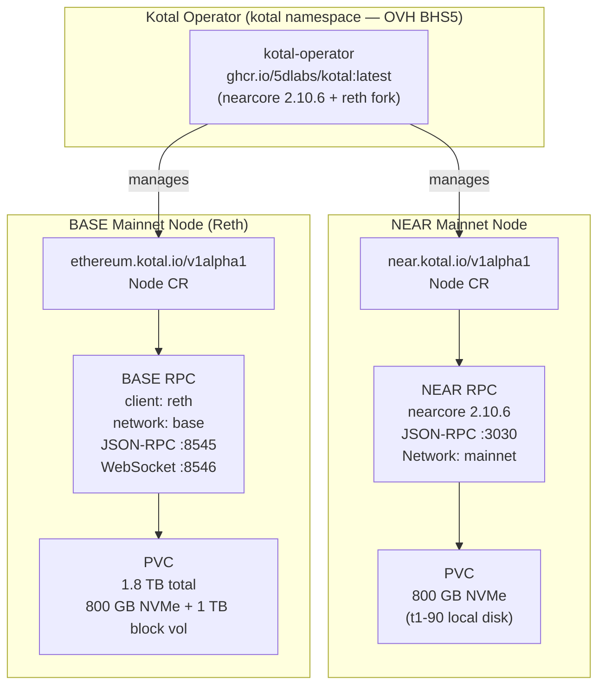
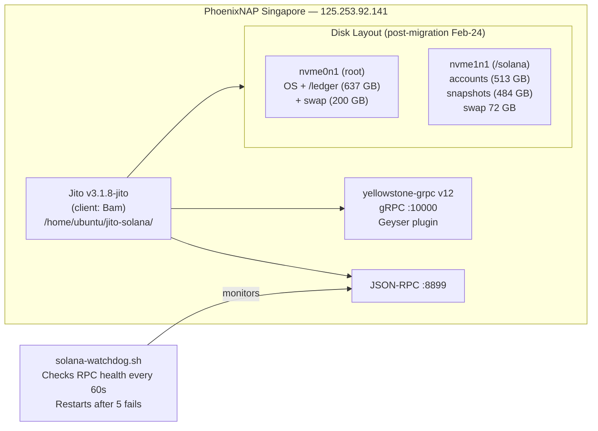
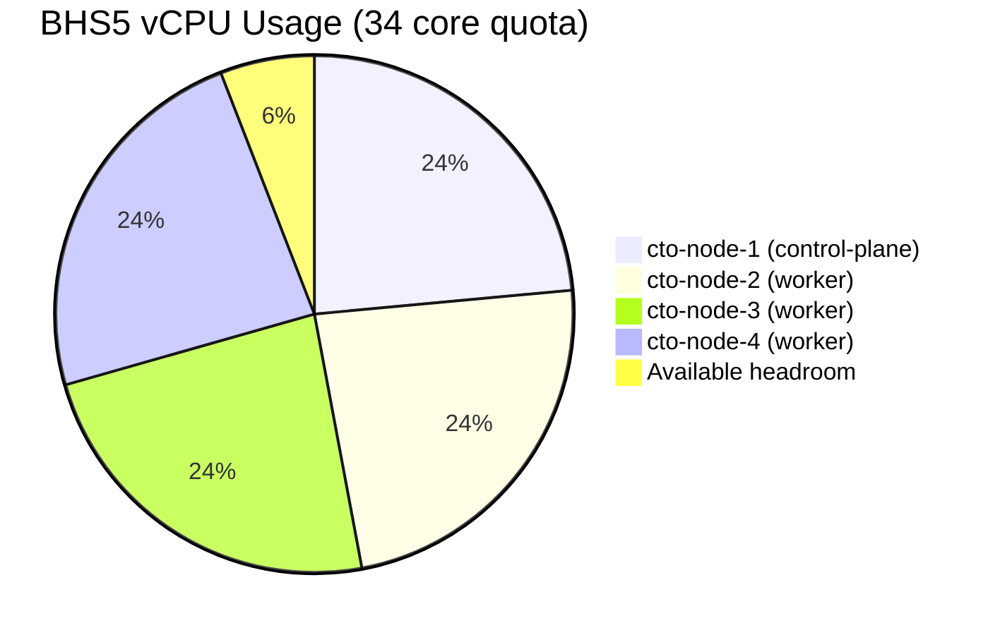

# Blockchain Node Specifications

> Managed via [5dlabs/kotal](https://github.com/5dlabs/kotal) fork — deployed as Kubernetes CRDs on the CTO cluster.
> Kotal operator is running in the `kotal` namespace on OVH BHS5.

---

## Overview



---

## NEAR Mainnet

### Hardware Requirements

| Resource | Minimum | Recommended |
|---|---|---|
| vCPU | 8 | 16 |
| RAM | 24 GB | 64 GB+ |
| Storage | 500 GB NVMe | 1 TB NVMe |
| Network | 1 Gbps | 1 Gbps+ |

### OVH Instance: `t1-90`

| Property | Value |
|---|---|
| vCPU | 16 |
| RAM | 90 GB |
| Disk | 800 GB NVMe |
| Network | Up to 1 Gbps |
| Region | BHS5 |

### Kotal CRD (example)

```yaml
apiVersion: near.kotal.io/v1alpha1
kind: Node
metadata:
  name: near-mainnet
  namespace: blockchain
spec:
  network: mainnet
  nodePrivateKeySecretName: near-node-key
  rpc: true
  resources:
    cpu: "8"
    memory: "32Gi"
    storage: "750Gi"
    storageClass: "local-nvme"
```

---

## BASE Mainnet (via Reth)

### Hardware Requirements

| Resource | Minimum | Recommended |
|---|---|---|
| vCPU | 8 | 16+ |
| RAM | 32 GB | 64 GB+ |
| Storage | 1.5 TB NVMe | 2 TB+ NVMe |
| Network | 1 Gbps | 1 Gbps+ |

> BASE is an OP Stack L2. Reth syncs both the L2 chain and reads L1 (Ethereum mainnet) state.
> Storage grows ~500 GB/year for archive, ~250 GB/year for pruned.

### OVH Instance Options

| Instance | vCPU | RAM | Disk | Notes |
|---|---|---|---|---|
| `t1-90` | 16 | 90 GB | 800 GB NVMe | Add 1 TB OVH block vol for archive |
| `t2-90` | 30 | 90 GB | 800 GB NVMe | More CPU for faster sync |
| `t1-180` | 32 | 180 GB | 400 GB NVMe | ⚠️ Less disk — needs 2×1 TB block vols |
| `t1-le-90` | 16 | 90 GB | 400 GB NVMe | ❌ Too small |

**Recommended: `t1-90` + 1 TB OVH block volume**

### Kotal CRD (example)

```yaml
apiVersion: ethereum.kotal.io/v1alpha1
kind: Node
metadata:
  name: base-mainnet
  namespace: blockchain
spec:
  network: base
  client: reth
  rpc: true
  ws: true
  resources:
    cpu: "8"
    memory: "32Gi"
    storage: "1500Gi"
    storageClass: "local-nvme"
```

---

## Solana RPC Node (External — PhoenixNAP Singapore)

> Not managed by Kotal. Standalone bare-metal deployment.



### Key Configuration

| Setting | Value | Reason |
|---|---|---|
| `vm.swappiness` | 1 | Prevents swap thrashing |
| `--ledger` | `/ledger` (root disk) | Isolated I/O from accounts |
| `--accounts-dir` | `/solana/accounts` | Separate NVMe |
| `--snapshot-interval-slots` | 5000 | Reduce snapshot I/O |
| `--no-rocksdb-compaction` | removed in v3.1.8 | Not supported |
| Secondary indexes | disabled | Saves 60–80 GB RAM |
| yellowstone-grpc | v12.1.0-rc5 | gRPC streaming |

---

## Cluster Capacity: OVH BHS5 Quota

> **Current state:** 32 / 34 cores used. **Quota increase required before adding new VMs.**



### To provision NEAR + BASE nodes:
- **Need ~32 additional cores** (2× t1-90 = 32 vCPU)
- **Action required:** Request OVH BHS5 quota increase to ≥80 cores
  - OVH Console → Project `6093a51de65b458e8b20a7c570a4f2c1` → Quota → Request increase
  - Justify: blockchain RPC nodes for production Web3 infrastructure
