# Blockchain Node Specifications

> Managed via [5dlabs/kotal](https://github.com/5dlabs/kotal) fork — deployed as Kubernetes CRDs.
> Kotal operator is live in the `kotal` namespace on the BHS5 CTO cluster.
> Blockchain VMs will be provisioned in **OVH BHS5** (same DC as CTO cluster).
>
> ⚠️ **Blocker:** BHS5 quota is at 32/34 cores. Both t1-90 VMs need ~32 additional cores.
> Jon needs to request a quota increase before provisioning.

---

## Deployment Overview

```mermaid
flowchart TB
    subgraph BHS5["🇨🇦  OVH BHS5 — Beauharnois, Canada"]
        direction TB

        subgraph CTO_CLUSTER["CTO RKE2 Cluster  (existing)"]
            KOTAL["kotal-operator\n(kotal namespace)\nghcr.io/5dlabs/kotal:latest"]
        end

        subgraph NEAR_VM["New VM: t1-90  (NEAR Mainnet)"]
            NEAR_NODE["near.kotal.io/v1alpha1 Node\nnearcore 2.10.6\nJSON-RPC :3030\n800 GB NVMe"]
        end

        subgraph BASE_VM["New VM: t1-90 or t2-90  (BASE Mainnet)"]
            BASE_NODE["ethereum.kotal.io/v1alpha1 Node\nclient: reth · network: base\nJSON-RPC :8545 · WS :8546\n800 GB NVMe + 1 TB block vol"]
        end

        KOTAL -->|"manages via CRD"| NEAR_NODE
        KOTAL -->|"manages via CRD"| BASE_NODE
    end
```



---

## NEAR Mainnet

### Instance: `t1-90` (OVH BHS5)

| Resource | `t1-90` | NEAR Requirement |
|---|---|---|
| vCPU | 16 | ≥ 8 |
| RAM | 90 GB | ≥ 24 GB |
| Disk | 800 GB NVMe | ≥ 500 GB |
| Network | 1 Gbps | 1 Gbps |
| Region | BHS5 🇨🇦 | — |

### Kotal CRD

```yaml
apiVersion: near.kotal.io/v1alpha1
kind: Node
metadata:
  name: near-mainnet
  namespace: blockchain
spec:
  network: mainnet
  rpc: true
  resources:
    cpu: "8"
    memory: "32Gi"
    storage: "750Gi"
    storageClass: "local-nvme"
```

---

## BASE Mainnet (Reth)

> BASE is an OP Stack L2. Reth syncs both the BASE L2 chain and reads L1 Ethereum state.
> Storage grows ~250–500 GB/year depending on pruning mode.

### Instance Options (OVH BHS5)

| Instance | vCPU | RAM | NVMe Disk | Extra Storage | Total | Notes |
|---|---|---|---|---|---|---|
| `t1-90` | 16 | 90 GB | 800 GB | + 1 TB block vol | ~1.8 TB | ✅ Recommended |
| `t2-90` | 30 | 90 GB | 800 GB | + 1 TB block vol | ~1.8 TB | More CPU, faster sync |
| `t1-180` | 32 | 180 GB | 400 GB | + 2 × 1 TB vols | ~2.4 TB | ⚠️ More block vols needed |

**Recommended: `t1-90` + 1 TB OVH block volume** (attach to `/data/base`)

### Kotal CRD

```yaml
apiVersion: ethereum.kotal.io/v1alpha1
kind: Node
metadata:
  name: base-mainnet
  namespace: blockchain
spec:
  network: base
  client: reth
  rpc: true
  ws: true
  resources:
    cpu: "8"
    memory: "32Gi"
    storage: "1500Gi"
    storageClass: "local-nvme"
```

---

## BHS5 Quota & Provisioning Plan

```mermaid
flowchart TB
    subgraph NOW["Current State"]
        QUOTA["BHS5 vCPU Quota\n32 / 34 used\n2 cores free"]
        VMS["4× b2-30\n(8 vCPU each = 32 vCPU)"]
    end

    subgraph NEEDED["To Add Blockchain Nodes"]
        NEAR_REQ["t1-90 for NEAR\n+16 vCPU"]
        BASE_REQ["t1-90 for BASE\n+16 vCPU"]
        TOTAL["Total needed:\n+32 vCPU\nTarget quota: ≥ 70 cores"]
    end

    subgraph ACTION["Action Required"]
        INCREASE["Jon → OVH Console\nProject 6093a51d...\nBHS5 → Quota → Request Increase\nJustify: blockchain RPC infrastructure\nSuggest: 100 cores"]
    end

    NOW --> NEEDED --> ACTION
```



---

## NVMe Instance Comparison (BHS5)

| Instance | vCPU | RAM | Local NVMe | Network | Use Case |
|---|---|---|---|---|---|
| `t1-45` | 8 | 45 GB | 400 GB | 1 Gbps | Small nodes / dev |
| **`t1-90`** | **16** | **90 GB** | **800 GB** | **1 Gbps** | **NEAR + BASE ⭐** |
| `t1-180` | 32 | 180 GB | 400 GB | 1 Gbps | High CPU, less disk |
| `t2-45` | 15 | 45 GB | 400 GB | 1 Gbps | — |
| **`t2-90`** | **30** | **90 GB** | **800 GB** | **1 Gbps** | **BASE (faster sync)** |
| `t2-180` | 60 | 180 GB | 50 GB | 1 Gbps | ⚠️ Very small disk |
| `t1-le-90` | 16 | 90 GB | 400 GB | 1 Gbps | Less storage variant |
| `t1-le-180` | 32 | 180 GB | 400 GB | 1 Gbps | — |
