# CTO Platform Architecture

> **Last updated:** 2026-02-24
> Region key: BHS5 = OVH Beauharnois (Canada), GRA = OVH Gravelines (France), SGP = PhoenixNAP Singapore

---

## System Overview

```mermaid
flowchart TB
    %% ── External / Edge ──────────────────────────────────────────
    subgraph EDGE["☁️  Edge & DNS"]
        CF["Cloudflare\n*.5dlabs.ai\nTunnel: cto-main"]
        GH["GitHub\n5dlabs/cto\nArgoCD GitOps"]
    end

    %% ── CTO Cluster (OVH BHS5, Canada) ──────────────────────────
    subgraph BHS5["🇨🇦  OVH BHS5 — CTO Cluster (Montreal)"]
        direction TB

        subgraph CP["Control Plane — cto-node-1\n(b2-30 · 8 vCPU · 30 GB RAM · 51.79.26.198)"]
            RKE2["RKE2 v1.30.9\nCilium CNI\nkubeProxyReplacement=true"]
            ARGO["ArgoCD\nhttps://argocd.5dlabs.ai"]
            BAO["OpenBao (Vault)\n63 ExternalSecrets synced"]
        end

        subgraph WORKERS["Workers — cto-node-2/3/4\n(b2-30 · 8 vCPU · 30 GB RAM each)"]
            direction LR

            subgraph PLATFORM["Platform Services"]
                ING["ingress-nginx\nNodePort 30080/30444"]
                CERT["cert-manager"]
                CFTUN["cloudflared\nTunnel agent"]
                OBS["Prometheus + Grafana\nhttps://grafana.5dlabs.ai"]
            end

            subgraph AI["AI / ML Stack"]
                KUBEAI["KubeAI Operator\nCPU inference models"]
                OLLAMA["Ollama Operator"]
                LLAMA["LlamaStack Operator"]
                MODELS["Models (scale-from-zero)\n• deepseek-r1-1.5b (CPU)\n• qwen2.5-coder-1.5b (CPU)\n• nomic-embed-text (CPU)\n• deepseek-r1-8b (L4 GPU, standby)\n• llama-3.1-8b-fp8 (L4 GPU, standby)"]
            end

            subgraph BLOCKCHAIN["Blockchain Operators"]
                KOTAL["Kotal Operator\n(5dlabs/kotal fork)\nNEAR + BASE CRDs"]
                NEAR_NODE["NEAR Mainnet Node\n⚠️ pending NVMe VM"]
                BASE_NODE["BASE Mainnet Node (Reth)\n⚠️ pending NVMe VM"]
            end

            subgraph RUNNERS["CI/CD"]
                ARC["GitHub ARC Runners\n(self-hosted)"]
            end

            subgraph STORAGE["Storage"]
                LP["local-path provisioner\n(StorageClass: mayastor→local-path)\n200 GB SSD per node"]
            end
        end
    end

    %% ── GPU Compute (OVH GRA, France) ──────────────────────────
    subgraph GRA["🇫🇷  OVH GRA — GPU Compute (France)  [PLANNED]"]
        direction TB
        subgraph GPUCLUSTER["GPU Worker Nodes (join BHS5 cluster or standalone)"]
            H100["h100-760 (recommended)\n8× NVIDIA H100 80 GB\n640 GB VRAM total\n60 vCPU · 760 GB RAM\nMiniMax-Text-01 @ FP8 ✅"]
            H100MIN["h100-380 (minimum)\n4× NVIDIA H100 80 GB\n320 GB VRAM total\n30 vCPU · 380 GB RAM\nMiniMax-Text-01 @ INT4 ✅"]
            L40S["l40s-360 (mid-tier)\n4× NVIDIA L40S 48 GB\n192 GB VRAM total\n60 vCPU · 360 GB RAM\nModels up to 70B @ FP8"]
        end
        MINIMAX["MiniMax-Text-01\n456B total params\n45.9B active/token (MoE)\n1M token context window\nKubeAI inference endpoint"]
    end

    %% ── Solana RPC (PhoenixNAP, Singapore) ──────────────────────
    subgraph SGP["🇸🇬  PhoenixNAP Singapore — Solana RPC"]
        SOL["Jito v3.1.8-jito (client:Bam)\nyellowstone-grpc v12 (gRPC :10000)\nRPC :8899\nnvme0n1: OS + ledger (637 GB)\nnvme1n1: accounts (513 GB) + snapshots (484 GB)\n500 GB RAM · vm.swappiness=1"]
    end

    %% ── Connections ─────────────────────────────────────────────
    CF -->|"HTTPS → NodePort 30444"| WORKERS
    CF -->|"tunnel"| CFTUN
    GH -->|"GitOps sync"| ARGO
    ARGO -->|"manages"| AI
    ARGO -->|"manages"| PLATFORM
    ARGO -->|"manages"| BLOCKCHAIN
    BAO -->|"ExternalSecrets"| WORKERS
    KUBEAI -->|"GPU inference\n(when GPU nodes added)"| GPUCLUSTER
    KOTAL -->|"manages"| NEAR_NODE
    KOTAL -->|"manages"| BASE_NODE
    H100 --> MINIMAX
```

---

## Network Topology

---

## Disk & Storage Layout

```mermaid
flowchart TB
    subgraph SOL_NODE["Solana Node (PhoenixNAP 125.253.92.141)"]
        direction LR
        subgraph nvme0["nvme0n1 — Root Disk (3.5 TB)"]
            OS["OS / system\n~100 GB"]
            SWAP3["swapfile3\n200 GB (prio 5)"]
            LEDGER["/ledger\nRocksDB blockstore\n~637 GB ← migrated Feb-24"]
        end
        subgraph nvme1["/solana — Data Disk (3.5 TB)"]
            ACCT["/solana/accounts\n~513 GB\naccounts index"]
            SNAPS["/solana/snapshots\n~484 GB"]
            SWAP1["/swap.img 8 GB\n/swapfile2 64 GB"]
        end
    end

    subgraph CTO_NODES["CTO Workers (OVH BHS5)"]
        direction LR
        subgraph NODE2["cto-node-2 (b2-30)"]
            SSD2["200 GB SSD\nlocal-path PVCs"]
        end
        subgraph NODE3["cto-node-3 (b2-30)"]
            SSD3["200 GB SSD\nlocal-path PVCs"]
        end
        subgraph NODE4["cto-node-4 (b2-30)"]
            SSD4["200 GB SSD\nlocal-path PVCs"]
        end
    end

    subgraph PLANNED_NVME["Planned: NVMe VMs (OVH BHS5)\n⚠️ Requires quota increase (32/34 cores used)"]
        direction LR
        subgraph T1_90_NEAR["t1-90 — NEAR Mainnet"]
            NEAR_DISK["800 GB NVMe\nNEAR nearcore 2.10.6\nvia Kotal CRD"]
        end
        subgraph T1_90_BASE["t1-90 or t2-90 — BASE Mainnet"]
            BASE_DISK["800 GB NVMe\n+ 1 TB block volume\nReth client\nvia Kotal CRD"]
        end
    end
```

---

## GitOps Flow

