# CTO Platform Architecture

> **Last updated:** 2026-02-24
> **Infrastructure:** OVH Public Cloud — BHS5 (Beauharnois, Canada)

---

## System Overview

```mermaid
flowchart TB
    %% ── Edge ─────────────────────────────────────────────────────
    subgraph EDGE["☁️  Edge & DNS"]
        CF["Cloudflare\n*.5dlabs.ai\nTunnel: cto-main"]
        GH["GitHub\n5dlabs/cto\nArgoCD GitOps"]
    end

    %% ── OVH BHS5 ─────────────────────────────────────────────────
    subgraph BHS5["🇨🇦  OVH BHS5 — Beauharnois, Canada"]
        direction TB

        subgraph CP["Control Plane — cto-node-1  (b2-30 · 8 vCPU · 30 GB · 51.79.26.198)"]
            RKE2["RKE2 v1.30.9\nCilium CNI · kubeProxyReplacement=true\nkube-proxy disabled"]
            ARGO["ArgoCD\nargocd.5dlabs.ai"]
            BAO["OpenBao\n63 ExternalSecrets synced"]
        end

        subgraph WORKERS["Workers — cto-node-2/3/4  (b2-30 · 8 vCPU · 30 GB each)"]
            direction LR

            subgraph PLATFORM["Platform"]
                ING["ingress-nginx\n:30080 / :30444"]
                CERT["cert-manager"]
                CFTUN["cloudflared\ncto-main tunnel"]
                OBS["Grafana\ngrafana.5dlabs.ai"]
                ESO["external-secrets\noperator"]
            end

            subgraph AI["AI / ML  (CPU — scale-from-zero)"]
                KUBEAI["KubeAI Operator"]
                MODELS["• deepseek-r1-1.5b\n• qwen2.5-coder-1.5b\n• nomic-embed-text\n• deepseek-r1-8b  ⟵ GPU standby\n• llama-3.1-8b-fp8  ⟵ GPU standby"]
                OLLAMA["Ollama Operator"]
                LLAMA["LlamaStack Operator"]
            end

            subgraph BLOCKCHAIN["Blockchain (Kotal Operator)"]
                KOTAL["kotal-operator\nghcr.io/5dlabs/kotal:latest\nnearcore 2.10.6 + reth"]
                NEAR_NODE["NEAR Mainnet Node\nⓘ pending NVMe VM"]
                BASE_NODE["BASE Mainnet Node (Reth)\nⓘ pending NVMe VM"]
                KOTAL --> NEAR_NODE
                KOTAL --> BASE_NODE
            end

            subgraph INFRA["Infrastructure"]
                ARC["ARC Runners\n(GitHub Actions)"]
                LP["local-path provisioner\n200 GB SSD / node"]
                NVIDIA["Nvidia GPU Operator\n+ NFD (standby)"]
            end
        end

        subgraph NVME["NVMe VMs — Planned  (requires quota increase: 32/34 cores used)"]
            T1_NEAR["t1-90\n16 vCPU · 90 GB · 800 GB NVMe\nNEAR Mainnet"]
            T1_BASE["t1-90 or t2-90\n16–30 vCPU · 90 GB · 800 GB NVMe\nBASE Mainnet (Reth)"]
        end
    end

    %% ── GPU Region (cross-DC) ────────────────────────────────────
    subgraph GRA["🇫🇷  OVH GRA — Gravelines, France  (GPU only)"]
        GPU["GPU Instances\n(see GPU Capacity doc)\nAll OVH GPU compute\nlives here — not in BHS5"]
    end

    %% ── Connections ─────────────────────────────────────────────
    CF -->|"HTTPS → :30444"| CFTUN
    GH -->|"GitOps sync"| ARGO
    ARGO -->|"manages all apps"| WORKERS
    BAO -->|"secrets"| ESO
    KUBEAI -.->|"GPU inference\n(cross-region, planned)"| GPU

    style GRA fill:#fff3e0,stroke:#f57c00
    style NVME fill:#e8f5e9,stroke:#388e3c
```

---

## Cluster Node Inventory

```mermaid
flowchart LR
    subgraph CLUSTER["RKE2 Cluster — OVH BHS5"]
        direction TB
        N1["cto-node-1\n51.79.26.198\nb2-30 · control-plane\n8 vCPU · 30 GB · 200 GB SSD"]
        N2["cto-node-2\n51.79.29.63\nb2-30 · worker\n8 vCPU · 30 GB · 200 GB SSD"]
        N3["cto-node-3\n148.113.141.154\nb2-30 · worker\n8 vCPU · 30 GB · 200 GB SSD"]
        N4["cto-node-4\n15.235.46.13\nb2-30 · worker\n8 vCPU · 30 GB · 200 GB SSD"]
    end

    subgraph QUOTA["BHS5 vCPU Quota"]
        Q["32 / 34 cores used\n⚠️ 2 cores headroom\nRequest increase before\nadding blockchain VMs"]
    end
```

---

## Network / Ingress

---

## GitOps Flow

---

## Storage Layout

```mermaid
flowchart TB
    subgraph CTO_WORKERS["CTO Worker Nodes (b2-30 · 200 GB SSD each)"]
        direction LR
        W2["cto-node-2\n200 GB SSD\nlocal-path PVCs"]
        W3["cto-node-3\n200 GB SSD\nlocal-path PVCs"]
        W4["cto-node-4\n200 GB SSD\nlocal-path PVCs"]
    end

    subgraph PLANNED["Planned NVMe VMs (OVH BHS5)"]
        direction LR
        NEAR_VM["t1-90 → NEAR Mainnet\n800 GB NVMe local disk\n+ optional block volume"]
        BASE_VM["t1-90 / t2-90 → BASE Mainnet\n800 GB NVMe\n+ 1 TB OVH block volume\n(~1.8 TB total)"]
    end

    NOTE["StorageClass 'mayastor'\nmapped → rancher.io/local-path\nWaitForFirstConsumer"]
    CTO_WORKERS --- NOTE
```

