# GPU Capacity Planning — MiniMax-Text-01

> OVH GPU instances are available in **GRA (Gravelines/Roubaix, France)** only.
> CTO cluster is in **BHS5 (Beauharnois, Canada)**.
> GPU nodes can either join the existing RKE2 cluster (cross-region worker) or form a dedicated GRA inference cluster.

---

## MiniMax-Text-01 Requirements

| Property | Value |
|---|---|
| Model | MiniMax-Text-01 (MiniMax-2) |
| Total Parameters | **456 B** |
| Active Parameters / Token | **45.9 B** (MoE top-2 routing) |
| Architecture | Hybrid Lightning + Softmax Attention + MoE |
| Experts | 32 total, top-2 per token |
| Layers | 80 |
| Context Window (training) | 1M tokens |
| Context Window (inference) | Up to 4M tokens |
| License | Non-commercial research (check MiniMax terms) |

### VRAM Requirements by Precision

| Precision | VRAM Needed | Notes |
|---|---|---|
| FP16 (full) | ~912 GB | All 456B params × 2 bytes |
| FP8 | ~456 GB | Recommended for inference throughput |
| INT8 (GPTQ/AWQ) | ~456 GB | Similar to FP8 |
| INT4 (GPTQ/AWQ) | ~228 GB | Minimum viable; some quality loss |

> **Note:** MoE architecture means only 45.9B params are active per token, but **all 456B params must reside in VRAM** (all expert weights loaded). VRAM requirement is driven by total params, not active params.

---

## OVH GPU Instance Inventory

> All GPU instances are in **GRA9 or GRA11** (Gravelines, France).
> Prices are indicative — check OVH console for current hourly/monthly rates.

### NVIDIA H100 SXM (80 GB each) — Best for LLM Inference

```mermaid
flowchart LR
    subgraph H100_LINEUP["NVIDIA H100 SXM Instances (OVH GRA9 / GRA11)"]
        direction TB
        H380["h100-380\n━━━━━━━━━━━━━━\n30 vCPU\n380 GB RAM\n200 GB NVMe\n4× H100 80GB\n320 GB VRAM\n━━━━━━━━━━━━━━\n✅ MiniMax INT4"]
        H760["h100-760\n━━━━━━━━━━━━━━\n60 vCPU\n760 GB RAM\n200 GB NVMe\n8× H100 80GB\n640 GB VRAM\n━━━━━━━━━━━━━━\n✅ MiniMax FP8\n⭐ RECOMMENDED"]
        H1520["h100-1520\n━━━━━━━━━━━━━━\n120 vCPU\n1520 GB RAM\n200 GB NVMe\n16× H100 80GB\n1280 GB VRAM\n━━━━━━━━━━━━━━\n✅ MiniMax FP16"]
    end
    H380 --> H760 --> H1520
```

### NVIDIA A100 SXM (80 GB each) — Good Value

```mermaid
flowchart LR
    subgraph A100_LINEUP["NVIDIA A100 Instances (OVH GRA11)"]
        direction TB
        A180["a100-180\n━━━━━━━━━━━━━━\n15 vCPU\n180 GB RAM\n300 GB NVMe\n2× A100 80GB\n160 GB VRAM\n━━━━━━━━━━━━━━\n✅ Models ≤70B @ FP8"]
        A360["a100-360\n━━━━━━━━━━━━━━\n30 vCPU\n360 GB RAM\n500 GB NVMe\n4× A100 80GB\n320 GB VRAM\n━━━━━━━━━━━━━━\n✅ MiniMax INT4"]
        A720["a100-720\n━━━━━━━━━━━━━━\n60 vCPU\n720 GB RAM\n50 GB disk\n8× A100 80GB\n640 GB VRAM\n━━━━━━━━━━━━━━\n✅ MiniMax FP8"]
    end
    A180 --> A360 --> A720
```

### NVIDIA L40S (48 GB each) — Balanced Cost/Performance

```mermaid
flowchart LR
    subgraph L40S_LINEUP["NVIDIA L40S Instances (OVH GRA11)"]
        direction TB
        LS90["l40s-90\n━━━━━━━━━━━━━━\n15 vCPU\n90 GB RAM\n400 GB NVMe\n1× L40S 48GB\n48 GB VRAM\n━━━━━━━━━━━━━━\n✅ Models ≤13B @ FP16\n✅ Models ≤34B @ INT4"]
        LS180["l40s-180\n━━━━━━━━━━━━━━\n30 vCPU\n180 GB RAM\n400 GB NVMe\n2× L40S 48GB\n96 GB VRAM\n━━━━━━━━━━━━━━\n✅ Models ≤70B @ INT4"]
        LS360["l40s-360\n━━━━━━━━━━━━━━\n60 vCPU\n360 GB RAM\n400 GB NVMe\n4× L40S 48GB\n192 GB VRAM\n━━━━━━━━━━━━━━\n✅ Models ≤70B @ FP8"]
    end
    LS90 --> LS180 --> LS360
```

### NVIDIA L4 (24 GB each) — Lightweight / Dev

```mermaid
flowchart LR
    subgraph L4_LINEUP["NVIDIA L4 Instances (OVH GRA11)"]
        direction TB
        L90["l4-90\n━━━━━━━━━━━━━━\n22 vCPU\n90 GB RAM\n400 GB NVMe\n1× L4 24GB\n24 GB VRAM\n━━━━━━━━━━━━━━\n✅ Models ≤13B @ FP16\n(KubeAI standby nodes)"]
        L180["l4-180\n━━━━━━━━━━━━━━\n45 vCPU\n180 GB RAM\n400 GB NVMe\n2× L4 24GB\n48 GB VRAM"]
        L360["l4-360\n━━━━━━━━━━━━━━\n90 vCPU\n360 GB RAM\n400 GB NVMe\n4× L4 24GB\n96 GB VRAM"]
    end
    L90 --> L180 --> L360
```

---

## MiniMax-Text-01 Instance Recommendation

```mermaid
flowchart TB
    subgraph DECISION["Instance Selection — MiniMax-Text-01"]
        BUDGET{"Budget\npriority?"}

        BUDGET -->|"Minimum cost\n(acceptable quality loss)"| H380_REC
        BUDGET -->|"Production\n(recommended)"| H760_REC
        BUDGET -->|"Full precision\n(research)"| H1520_REC
        BUDGET -->|"Cost-optimized\n(A100 vs H100)"| A720_REC

        H380_REC["h100-380\n4× H100 80GB = 320GB VRAM\nINT4 quantized (AWQ/GPTQ)\n~228 GB needed\n⚠️ Tight fit; batch size limited"]

        H760_REC["h100-760 ⭐\n8× H100 80GB = 640GB VRAM\nFP8 precision\n~456 GB needed\n✅ Good throughput + quality\nRecommended starting point"]

        H1520_REC["h100-1520\n16× H100 80GB = 1280GB VRAM\nFP16 full precision\n~912 GB needed\n✅ Maximum quality\nHighest cost"]

        A720_REC["a100-720\n8× A100 80GB = 640GB VRAM\nFP8 precision (same as h100-760)\n~456 GB needed\n⚠️ Lower throughput than H100\nbut cheaper hourly"]
    end
```

---

## Full GPU Inventory Table

| Instance | Region | vCPU | RAM | Disk | GPU | Count | VRAM/GPU | Total VRAM | MiniMax Support |
|---|---|---|---|---|---|---|---|---|---|
| `l4-90` | GRA11 | 22 | 90 GB | 400 GB NVMe | L4 | 1 | 24 GB | 24 GB | ❌ |
| `l4-180` | GRA11 | 45 | 180 GB | 400 GB NVMe | L4 | 2 | 24 GB | 48 GB | ❌ |
| `l4-360` | GRA11 | 90 | 360 GB | 400 GB NVMe | L4 | 4 | 24 GB | 96 GB | ❌ |
| `l40s-90` | GRA11 | 15 | 90 GB | 400 GB NVMe | L40S | 1 | 48 GB | 48 GB | ❌ |
| `l40s-180` | GRA11 | 30 | 180 GB | 400 GB NVMe | L40S | 2 | 48 GB | 96 GB | ❌ |
| `l40s-360` | GRA11 | 60 | 360 GB | 400 GB NVMe | L40S | 4 | 48 GB | 192 GB | ❌ |
| `a100-180` | GRA11 | 15 | 180 GB | 300 GB NVMe | A100 80GB | 2 | 80 GB | 160 GB | ❌ |
| `a100-360` | GRA11 | 30 | 360 GB | 500 GB NVMe | A100 80GB | 4 | 80 GB | 320 GB | ✅ INT4 |
| `a100-720` | GRA11 | 60 | 720 GB | 50 GB | A100 80GB | 8 | 80 GB | 640 GB | ✅ FP8 |
| `h100-380` | GRA9/11 | 30 | 380 GB | 200 GB | H100 80GB SXM | 4 | 80 GB | 320 GB | ✅ INT4 |
| `h100-760` | GRA9/11 | 60 | 760 GB | 200 GB | H100 80GB SXM | 8 | 80 GB | 640 GB | ✅ FP8 ⭐ |
| `h100-1520` | GRA9/11 | 120 | 1520 GB | 200 GB | H100 80GB SXM | 16 | 80 GB | 1280 GB | ✅ FP16 |

---

## Deployment Architecture for MiniMax Inference

