# GPU Capacity Planning — MiniMax-Text-01

> **⚠️ Same-DC Constraint:** OVH does **not** offer GPU instances in BHS5 (Canada).
> All GPU compute is in **GRA9/GRA11 (Gravelines, France)** only.
> This means GPU nodes cannot be co-located with the CTO cluster in BHS5.
>
> **Options:**
> A) Accept cross-region: add GRA GPU workers to the BHS5 RKE2 cluster (~80ms latency)
> B) Stand up a separate RKE2 cluster in GRA for inference only
> C) Wait for OVH to expand GPU inventory to Canadian regions (no ETA)

---

## OVH Region / GPU Availability Map

```mermaid
flowchart LR
    subgraph BHS5["🇨🇦  OVH BHS5 — Beauharnois, Canada"]
        CTO["CTO Cluster\n4× b2-30\nRKE2 + Cilium"]
        BLOCKCHAIN["Blockchain NVMe VMs\n(planned)"]
        NO_GPU["❌ No GPU instances\navailable in this region"]
    end

    subgraph GRA["🇫🇷  OVH GRA — Gravelines, France"]
        GPU_INV["✅ All GPU inventory\nA100 · H100 · L4 · L40S\n(GRA9 and GRA11)"]
    end

    CTO -.->|"cross-region\n~80ms"| GPU_INV
    style NO_GPU fill:#ffebee,stroke:#c62828
    style GPU_INV fill:#e8f5e9,stroke:#2e7d32
```

---

## MiniMax-Text-01 Model Specs

| Property | Value |
|---|---|
| Model | MiniMax-Text-01 (MiniMax-2) |
| Total Parameters | **456 B** |
| Active Parameters / Token | **45.9 B** (MoE, top-2 routing) |
| Architecture | Hybrid Lightning + Softmax Attention + MoE |
| Context (training) | 1M tokens |
| Context (inference) | Up to 4M tokens |

### VRAM by Precision

| Precision | VRAM Required | Notes |
|---|---|---|
| FP16 | ~912 GB | All 456B × 2 bytes |
| FP8 | ~456 GB | Recommended for production inference |
| INT4 (AWQ/GPTQ) | ~228 GB | Minimum; some quality loss |

> All 456B params must be resident in VRAM regardless of MoE active-param count.

---

## OVH GPU Instance Inventory (GRA only)

```mermaid
flowchart TB
    subgraph GPU_CATALOG["OVH GPU Catalog — GRA9 / GRA11"]
        direction LR

        subgraph H100["NVIDIA H100 SXM 80GB"]
            H380["h100-380\n4× H100 · 320GB VRAM\n30 vCPU · 380 GB RAM\n200 GB NVMe\nGRA9 + GRA11\n✅ MiniMax INT4"]
            H760["h100-760 ⭐\n8× H100 · 640GB VRAM\n60 vCPU · 760 GB RAM\n200 GB NVMe\nGRA9 + GRA11\n✅ MiniMax FP8"]
            H1520["h100-1520\n16× H100 · 1280GB VRAM\n120 vCPU · 1520 GB RAM\n200 GB NVMe\nGRA9 + GRA11\n✅ MiniMax FP16"]
        end

        subgraph A100["NVIDIA A100 80GB"]
            A180["a100-180\n2× A100 · 160GB VRAM\n15 vCPU · 180 GB RAM\n300 GB NVMe · GRA11"]
            A360["a100-360\n4× A100 · 320GB VRAM\n30 vCPU · 360 GB RAM\n500 GB NVMe · GRA11\n✅ MiniMax INT4"]
            A720["a100-720\n8× A100 · 640GB VRAM\n60 vCPU · 720 GB RAM\n50 GB disk · GRA11\n✅ MiniMax FP8"]
        end

        subgraph L40S["NVIDIA L40S 48GB"]
            LS90["l40s-90\n1× L40S · 48GB VRAM\n15 vCPU · 90 GB RAM\n400 GB NVMe · GRA11"]
            LS180["l40s-180\n2× L40S · 96GB VRAM\n30 vCPU · 180 GB RAM\n400 GB NVMe · GRA11"]
            LS360["l40s-360\n4× L40S · 192GB VRAM\n60 vCPU · 360 GB RAM\n400 GB NVMe · GRA11"]
        end

        subgraph L4["NVIDIA L4 24GB"]
            L90["l4-90\n1× L4 · 24GB VRAM\n22 vCPU · 90 GB RAM\n400 GB NVMe · GRA11\n(KubeAI standby models)"]
            L180["l4-180\n2× L4 · 48GB VRAM\n45 vCPU · 180 GB RAM\nGRA11"]
            L360["l4-360\n4× L4 · 96GB VRAM\n90 vCPU · 360 GB RAM\nGRA11"]
        end
    end
```

---

## Full Inventory Table

| Instance | Region | vCPU | RAM | Disk | GPU Model | GPU Count | Total VRAM | MiniMax-Text-01 |
|---|---|---|---|---|---|---|---|---|
| `l4-90` | GRA11 | 22 | 90 GB | 400 GB NVMe | L4 24GB | 1 | 24 GB | ❌ |
| `l4-180` | GRA11 | 45 | 180 GB | 400 GB NVMe | L4 24GB | 2 | 48 GB | ❌ |
| `l4-360` | GRA11 | 90 | 360 GB | 400 GB NVMe | L4 24GB | 4 | 96 GB | ❌ |
| `l40s-90` | GRA11 | 15 | 90 GB | 400 GB NVMe | L40S 48GB | 1 | 48 GB | ❌ |
| `l40s-180` | GRA11 | 30 | 180 GB | 400 GB NVMe | L40S 48GB | 2 | 96 GB | ❌ |
| `l40s-360` | GRA11 | 60 | 360 GB | 400 GB NVMe | L40S 48GB | 4 | 192 GB | ❌ |
| `a100-180` | GRA11 | 15 | 180 GB | 300 GB NVMe | A100 80GB | 2 | 160 GB | ❌ |
| `a100-360` | GRA11 | 30 | 360 GB | 500 GB NVMe | A100 80GB | 4 | 320 GB | ✅ INT4 |
| `a100-720` | GRA11 | 60 | 720 GB | 50 GB | A100 80GB | 8 | 640 GB | ✅ FP8 |
| `h100-380` | GRA9/11 | 30 | 380 GB | 200 GB | H100 80GB SXM | 4 | 320 GB | ✅ INT4 |
| **`h100-760`** | **GRA9/11** | **60** | **760 GB** | **200 GB** | **H100 80GB SXM** | **8** | **640 GB** | **✅ FP8 ⭐** |
| `h100-1520` | GRA9/11 | 120 | 1520 GB | 200 GB | H100 80GB SXM | 16 | 1280 GB | ✅ FP16 |

---

## Recommendation for MiniMax-Text-01

```mermaid
flowchart TB
    REQ["MiniMax-Text-01\n456B total params\n~456 GB VRAM needed @ FP8"]

    REQ --> TIER1
    REQ --> TIER2
    REQ --> TIER3

    TIER1["⭐ Recommended\nh100-760 (GRA9/GRA11)\n8× H100 80GB = 640GB VRAM\nFP8 precision — best quality/cost\n~30% VRAM headroom for KV cache"]

    TIER2["Minimum viable\nh100-380 (GRA9/GRA11)\n4× H100 80GB = 320GB VRAM\nINT4 quantized (AWQ)\n⚠️ tight fit, limited batch size"]

    TIER3["Budget alternative\na100-720 (GRA11)\n8× A100 80GB = 640GB VRAM\nFP8 precision\n~40% lower throughput vs H100"]

    TIER1 --> NOTE["All options require\ncross-region deployment\nBHS5 → GRA\n~80ms added latency\nfor inference requests"]
```

